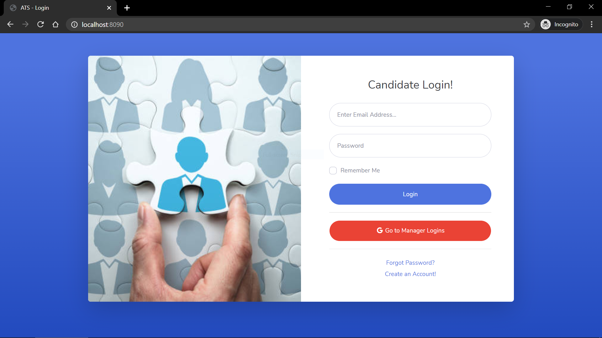

# Applicant-Tracking-System

Tired of getting tons of resumes and evaluating them one by one?
The whole process of recruitment of selecting the right resumes, filter them then finally hire candidates is so hectic and time-consuming.

Introducing Applicant Tracking System (ATS), which speeds up the recruitment process, by automatically evaluating the candidate experience which improves not the quality of hire but also lowers the cost per hire.

**Flow** 
First, an employee will register on the website.
Then the employee will upload his resume.
The manager can select the employee according to his requirement.
After selecting the employee the employee will get a notification that he is selected by the manager.

Following is the screenshots of the project .

1. Candidate Dashboard -

